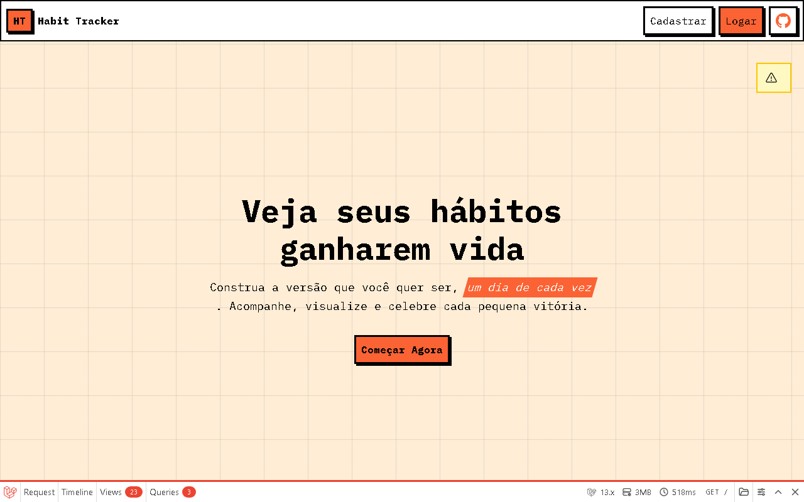
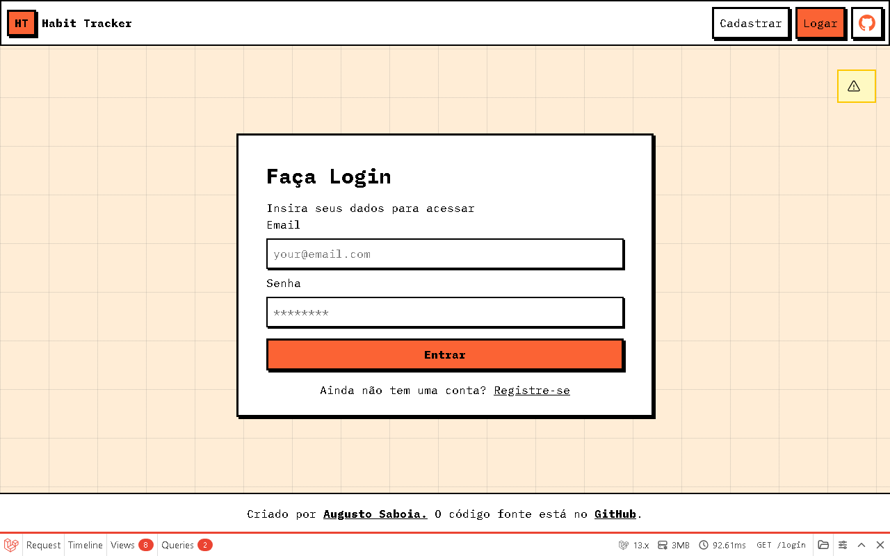
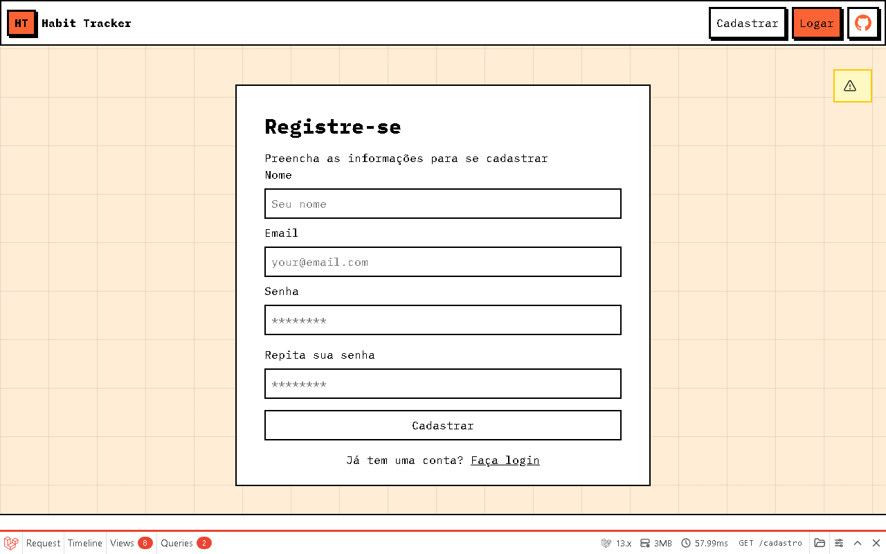
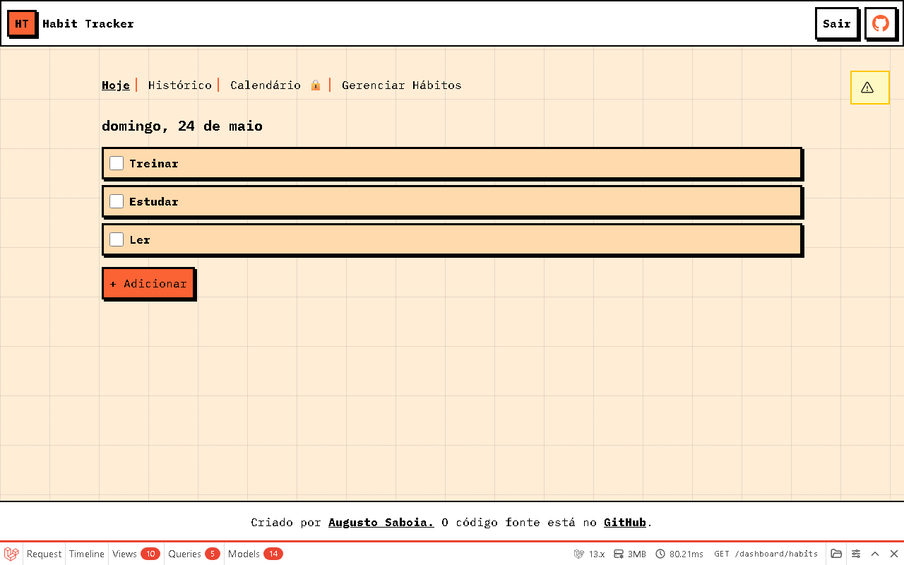
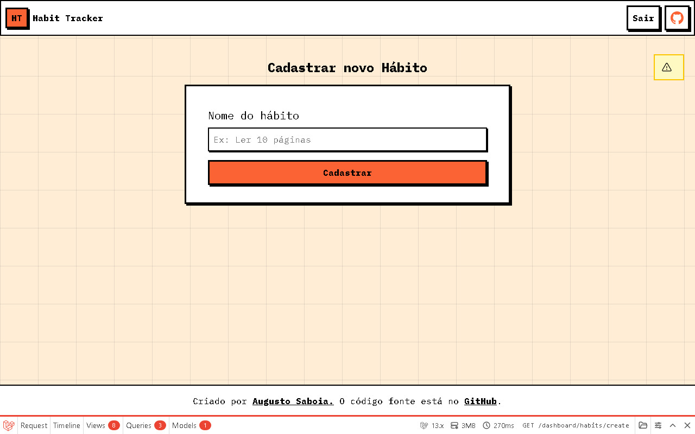
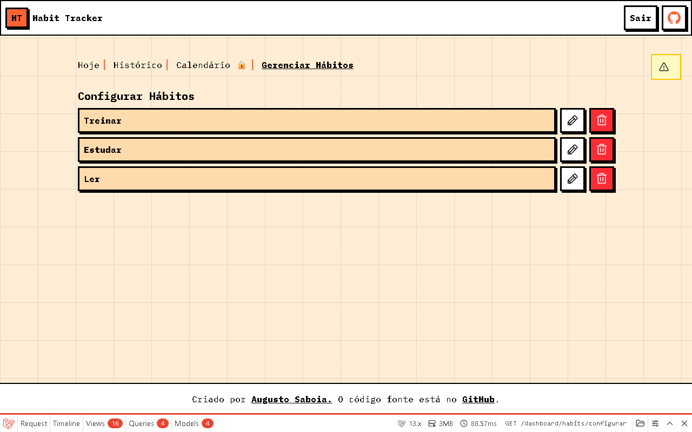
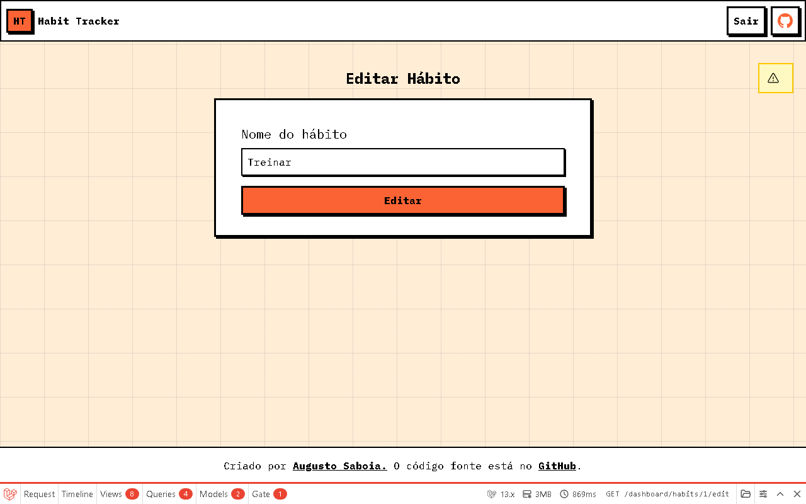
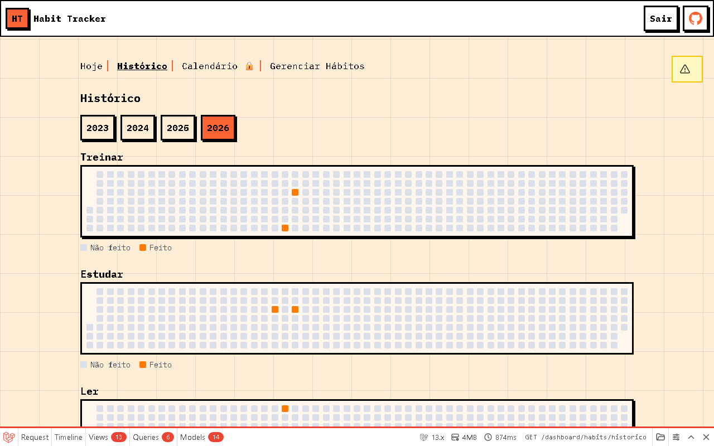

<h1 align="center">Habit Tracker</h1>

<p align="center">
  Acompanhe, visualize e celebre cada pequena vitória na construção dos seus hábitos diários.
</p>

<p align="center">
  
  
  
  
  
</p>

<p align="center">
  <a href="#sobre">Sobre</a> •
  <a href="#telas">Telas</a> •
  <a href="#funcionalidades">Funcionalidades</a> •
  <a href="#tecnologias">Tecnologias</a> •
  <a href="#como-instalar">Como Instalar</a> •
  <a href="#uso">Uso</a> •
  <a href="#estrutura">Estrutura</a> •
  <a href="#licença">Licença</a>
</p>

---

## Sobre

O **Habit Tracker** é uma aplicação web para rastreamento de hábitos diários. A ideia é simples: você cadastra os hábitos que quer desenvolver e marca cada dia que os realiza. Com o tempo, o sistema gera um histórico visual estilo GitHub contribution graph que mostra sua consistência ao longo do ano.

Desenvolvido com Laravel 13 no back-end, TailwindCSS 4 no front-end e Blade como template engine, com foco em simplicidade, velocidade e interface em português (pt_BR).

---

## Telas

### Home



Página inicial com hero section, slider de funcionalidades e FAQ.

---

### Login



Formulário de autenticação com email e senha. Exibe mensagens de erro de validação abaixo dos campos.

---

### Cadastro



Formulário de registro com nome, email, senha e confirmação. Após o cadastro, o usuário é redirecionado automaticamente ao dashboard.

---

### Dashboard — Hábitos do Dia



Lista os hábitos do usuário para o dia atual com a data em português. Cada item tem um checkbox: marcar registra o hábito como concluído; desmarcar desfaz o registro.

---

### Criar Hábito



Formulário simples para cadastrar um novo hábito pelo nome.

---

### Gerenciar Hábitos



Lista todos os hábitos com botões de editar (lápis) e deletar (lixeira) para cada item.

---

### Editar Hábito



Formulário pré-preenchido com o nome atual do hábito para edição.

---

### Histórico Anual



Visualização do histórico de cada hábito em contribution grid estilo GitHub. Dias concluídos aparecem em laranja, dias não realizados em cinza claro. Suporte a navegação por ano.

---

## Funcionalidades

- **Autenticação completa** — registro, login e logout com sessão e proteção CSRF
- **CRUD de hábitos** — criar, listar, editar e deletar hábitos com validação no servidor
- **Toggle diário** — marcar ou desmarcar hábito como concluído no dia atual com um clique
- **Histórico anual** — grade de contribuição por hábito com navegação entre anos disponíveis
- **Notificações toast** — feedback visual automático para ações (sucesso, aviso, erro)
- **Autorização** — usuário só acessa e modifica seus próprios hábitos (via Laravel Policies)
- **Interface em português** — datas, mensagens e toda a UI em pt_BR
- **Responsivo** — layout adaptado para mobile e desktop com TailwindCSS 4

---

## Tecnologias

| Camada | Tecnologia | Versão |
|--------|-----------|--------|
| Back-end | PHP | ^8.3 |
| Framework | Laravel | ^13.8 |
| Front-end | TailwindCSS | ^4.0 |
| Templates | Blade | — |
| Build | Vite | ^8.0 |
| Banco de dados | MySQL | 8.0 |
| ORM | Eloquent | — |
| Testes | PestPHP | ^4.7 |
| Qualidade | Laravel Pint | ^1.27 |
| Fontes | IBM Plex Mono + Instrument Sans | — |

---

## Como Instalar

### Pré-requisitos

- PHP 8.3 ou superior
- Composer
- Node.js 20+ e npm
- MySQL 8.0 ou superior

### Instalação

```bash
git clone https://github.com/augustosaboia/Habit-Tracker.git
cd Habit-Tracker
```

Configure o arquivo `.env` com suas credenciais MySQL antes de continuar:

```env
DB_CONNECTION=mysql
DB_HOST=127.0.0.1
DB_PORT=3306
DB_DATABASE=habit_tracker
DB_USERNAME=root
DB_PASSWORD=sua_senha
```

Em seguida, execute o setup automatizado:

```bash
composer setup
```

O script instala dependências PHP e JS, gera a chave da aplicação, roda as migrations e faz o build do front-end.

### Popular banco com dados de exemplo (opcional)

```bash
php artisan db:seed
```

---

## Uso

### Iniciar o servidor de desenvolvimento

```bash
composer dev
```

Acesse [http://127.0.0.1:8000](http://127.0.0.1:8000)

### Rodar testes

```bash
composer test
```

---

## Estrutura

```
habit-tracker/
├── app/
│   ├── Http/
│   │   ├── Controllers/
│   │   │   ├── Auth/
│   │   │   │   └── LoginController.php      # Login e logout
│   │   │   ├── HabitController.php          # CRUD + toggle + histórico
│   │   │   ├── RegisterController.php       # Registro de usuário
│   │   │   └── SiteController.php           # Home / landing
│   │   └── Requests/
│   │       ├── HabitRequest.php
│   │       ├── LoginRequest.php
│   │       └── RegisterRequest.php
│   ├── Models/
│   │   ├── Habit.php                        # Lógica de conclusão + grade anual
│   │   ├── HabitLog.php                     # Registro de conclusão diária
│   │   └── User.php
│   └── Policies/
│       └── HabitPolicy.php                  # Autorização por dono do hábito
├── database/
│   ├── migrations/                          # users, habits, habit_logs
│   ├── factories/
│   └── seeders/
├── resources/
│   ├── css/app.css
│   ├── js/
│   │   ├── app.js
│   │   └── toast.js
│   └── views/
│       ├── components/
│       │   ├── contribution.blade.php       # Grade de contribuição anual
│       │   ├── header.blade.php
│       │   ├── footer.blade.php
│       │   ├── layout.blade.php
│       │   ├── navbar.blade.php
│       │   └── toast.blade.php
│       ├── habits/
│       │   ├── create.blade.php
│       │   ├── edit.blade.php
│       │   └── history.blade.php
│       ├── dashboard.blade.php
│       ├── home.blade.php
│       ├── login.blade.php
│       ├── register.blade.php
│       └── settings.blade.php
└── routes/
    └── web.php
```

### Banco de Dados

```
users
├── id, name, email, password, timestamps

habits
├── id, user_id (FK → users), name, timestamps

habit_logs
├── id, user_id (FK → users), habit_id (FK → habits)
├── completed_at (date)
└── unique(user_id, habit_id, completed_at)
```

### Rotas

| Método | Rota | Descrição |
|--------|------|-----------|
| GET | `/` | Landing page |
| GET/POST | `/login` | Login |
| GET/POST | `/cadastro` | Registro |
| POST | `/logout` | Logout |
| GET | `/dashboard/habits` | Dashboard do dia |
| GET/POST | `/dashboard/habits/create` | Criar hábito |
| GET/PUT | `/dashboard/habits/{id}/edit` | Editar hábito |
| DELETE | `/dashboard/habits/{id}` | Deletar hábito |
| POST | `/dashboard/habits/{id}/toggle` | Marcar/desmarcar hábito |
| GET | `/dashboard/habits/configurar` | Gerenciar hábitos |
| GET | `/dashboard/habits/historico/{year?}` | Histórico anual |

---

## Licença

Este projeto está sob a licença MIT.

---

<p align="center">
  Criado por <a href="https://github.com/augustosaboia">Augusto Saboia</a>
</p>
